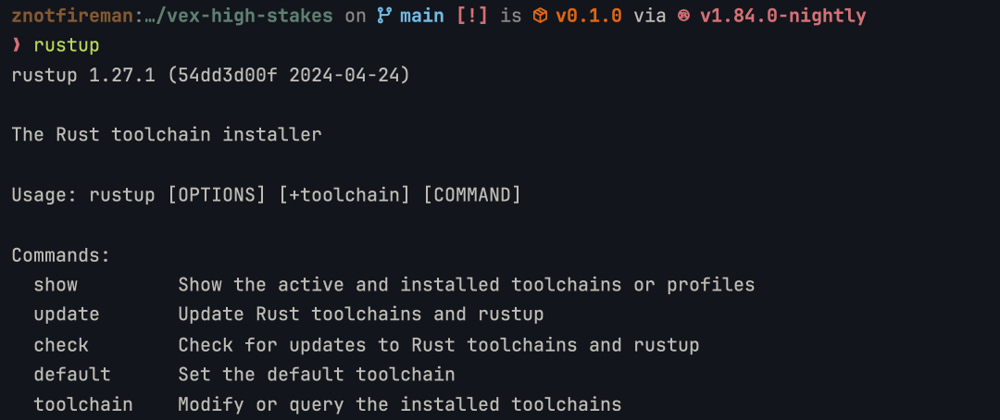
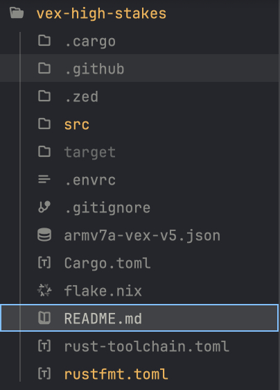

<!-- TODO: make this prettier -->

# VRC High Stakes 24-25

we <3 shaft collars

team [1599V](https://github.com/alexngyn/1599V-VRC-HIGH-STAKES) our biggest opp

## Development

You gotta learn Rust (trust me it’s nicer than C++ because I used both before
and Rust is defo better): <https://www.rust-lang.org/learn>

You will need either VSCode or Zed installed:
- VSCode: <https://code.visualstudio.com/>
- Zed: https://zed.dev/download, choose VSCode keybinds
    - I prefer this but most people use VSCode

### Setting up Rust
- Create a new terminal
- Open the Terminal app
    - In VSCode press Cmd+Shift+P then Create new terminal or just
        Option+Shift+Backticks (\`)
    - In Zed press Cmd+Shift+P assuming VSCode keybinds then workspace: new terminal
- Run `curl --proto '=https' --tlsv1.2 -sSf https://sh.rustup.rs | sh`, this
    - installs the Rust compiler
- Reopen the terminal for changes to take effect
- In the terminal, type `rustup` and press enter
- If you see this, you have the Rust compiler installed: 
- Run `rustup default nightly` press enter, this installs nightly Rust which is required for Vexide (community Rust VEX) to work:
- Copy the following commands and press enter for each, this installs the tooling required for Vexide:
    - `rustup component add rust-src`
    - `cargo install cargo-v5`

Before you edit on VSCode, install the [rust-analyzer] extension for better
developer experience with Rust. Zed already has built-in Rust support so
don’t worry :)

[rust-analyzer]: https://marketplace.visualstudio.com/items?itemName=rust-lang.rust-analyzer

### Setting up the project

- Open your editor (VSCode/Zed)
- Create a new folder for VEX:
    - In Zed press Cmd+Shift+P then type workspace: open, press that and then
        create a new folder, then select it and press Ok
    - In VSCode, create the folder in MacOS Finder, then return to VSCode,
        Cmd+Shift+P, then type File: Open Folder, press that and then just click
        until you find the folder you created (VSCode stinks okay)
    - I prefer to make the folder in Documents called “vex-high-stakes”
- Open up a new terminal:
    - In VSCode press Cmd+Shift+P then Create new terminal or just
        Option+Shift+Backticks (\`)
    - In Zed press Cmd+Shift+P assuming VSCode keybinds then workspace: new
        terminal
    - This should become second nature
- Run `git clone https://github.com/wucas-lu/vex-high-stakes .`, this copies the
    vex-high-stakes repository to your workspace:
    - Do not forget the period, this makes it so it copies to the current directory
- Verify you have something close to this: 

You need a GitHub account AND Git to share your changes and pull new changes:
- GitHub: <https://github.com/signup>
- Git: <https://git-scm.com/downloads>

Read this to set up Git with your GitHub account: <https://docs.github.com/en/get-started/getting-started-with-git/set-up-git>
Also join the wucas-lu repository so you have access to private repositories: <https://github.com/wucas-lu/>

### Editing

- In a terminal (you should know how to open one by now)
    - Run `cargo check` to check for warnings and errors
    - Run `cargo v5 build` to check if code compiles
    - Run `cargo v5 upload` with the controller plugged in to upload the program to the brain
    - Run `cargo v5 run` with the controller plugged in to upload the program to the brain AND run it
    - To commit changes:
        - `git add .` to add all changes
        - `git commit -m “feat: replace this with what you changed”` to commit changes
        - `git push` to push changes
        - `git pull` to pull all changes, use this when new code has been added by someone else
- Code is stored in the `src` folder:
    - autonomous.rs for autonomous control
    - driver.rs for driver control
    - lib.rs for utilities used in all code
    - main.rs for the competition code
    - robot.rs for the robot definition used in all code
    - screen.rs for the decoration for the Brain’s screen
- Output should be in your terminal if you run `cargo v5 run` as per above
- Program is in slot 3 with the X icon

Now read documentation for Rust VEX:
- V5 incomplete: <https://vexide.dev/docs/>
- V5 technical: <https://docs.rs/vexide/0.5.0-rc.2/vexide/>
- Drivetrain technical: <https://docs.rs/evian/0.3.0-beta.1/evian/>

## Todo

- [X] Competition setup via Vexide
- [X] Reorganize to modules
- [X] Stake piston control
- [X] Intake control
- [ ] Autonomous
